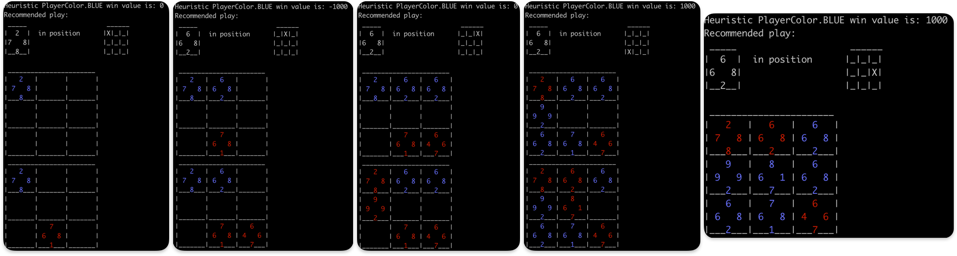
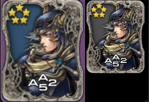
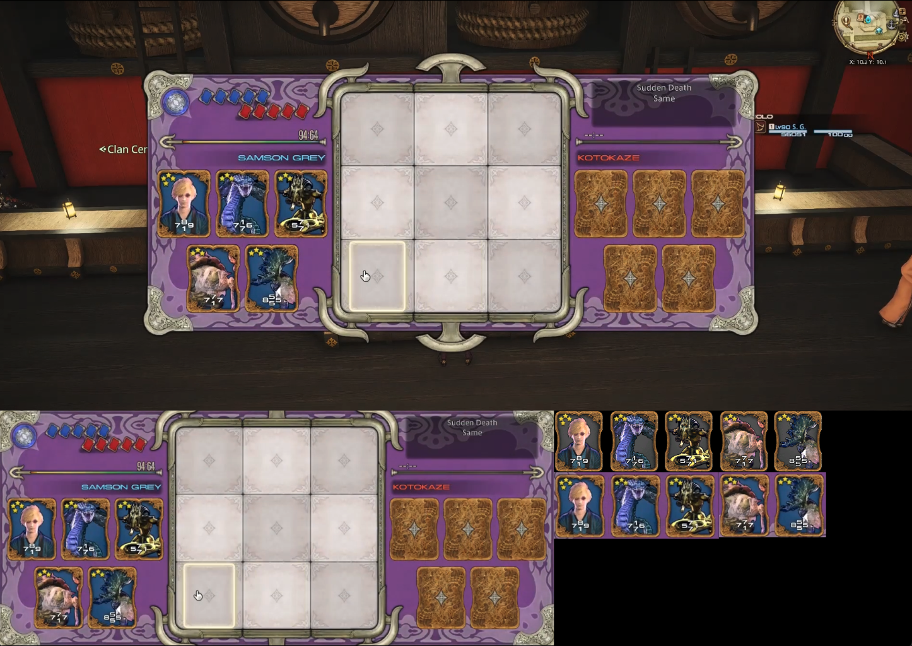

# tripleTriad
Triple Triad Game, inspired from FFXIV

Current version contains the skeleton of the game, where the cards to play must be defined in ```main.py```.

Using ```board.display()``` in that code allows to get an UI of the current board state, generated by OpenCV.

Future versions will include a smarter AI to play against and more features :)

Command lines parameters are currently not handled, but you can manually modify `main.py` to access different logic of the code.
- You can change `should_simulate_game` to see how the **Negamax** algorithm plays against a **random** algorithm
- You can change `should_try_recognize_card` to see how the algorithm tries to recognize cards based on pre-trimmed screenshots
- You can change `should_try_recognize_board` to recognize cards for the player on the left for a screenshot that contains a triple triad empty board (before any move was made).

# Examples:
## Game simulation
Changing `should_simulate_game` from `True` to `False` and running `python -m main` will play a game and display the board state:



## Card recognition
Changing `should_try_recognize_card` from `True` to `False` and running `python -m main` will display an image like this one:




## Board trimming into card recognition
Changing `should_try_recognize_board` from `True` to `False` and running `python -m main` will display an image like this one:

 
