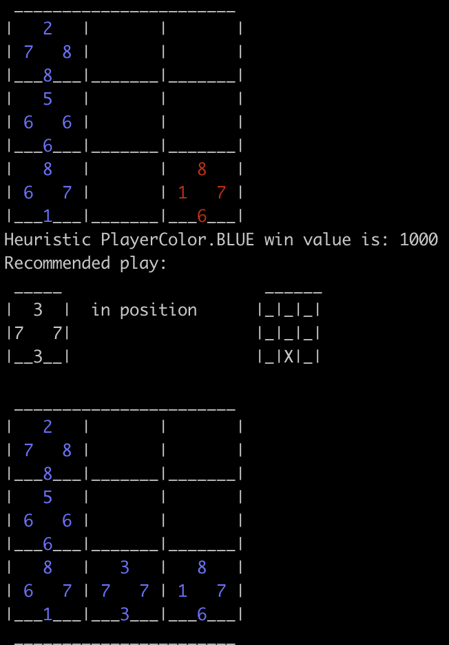

# Triple Triad AI

This repository contains tools to play with the [Triple Triad Card Game](https://eu.finalfantasyxiv.com/lodestone/playguide/contentsguide/goldsaucer/tripletriad/).
You can currently:
- See an AI (Negamax with Prunning) play optimally VS a Random algorithm.
- Use OCR to recognize cards from a picture into their in-game values.
- Use OCR, to take a picture of a board, and extract the cards available to the left player before the game starts.

## Setup
```
git clone https://github.com/Yuto3S/tripleTriad/
cd tripleTriad
pip install -r requirements.txt
pip install -r requirements-dev.txt
python -m main
```

## Examples:
Running `python -m main` will currently show example of those 3 functionalities.

### Game simulation
Changing `should_simulate_game` handles the automated AI VS Random plays:



### Card recognition
Changing `should_try_recognize_card` handles card recognition:


### Board trimming into card recognition
Changing `should_try_recognize_board` handles board trimming and card recognition:

 


## Code modifications:
Command lines parameters are currently not handled, but you can manually modify `main.py` to access different logic of the code.
- You can change `should_simulate_game` to see how the **Negamax** algorithm plays against a **random** algorithm
- You can change `should_try_recognize_card` to see how the algorithm tries to recognize cards based on pre-trimmed screenshots
- You can change `should_try_recognize_board` to recognize cards for the player on the left for a screenshot that contains a triple triad empty board (before any move was made).


### This application is made by a fan and is not affiliated to Square Enix.
### © 2010 - 2024 SQUARE ENIX CO., LTD. All Rights Reserved.
